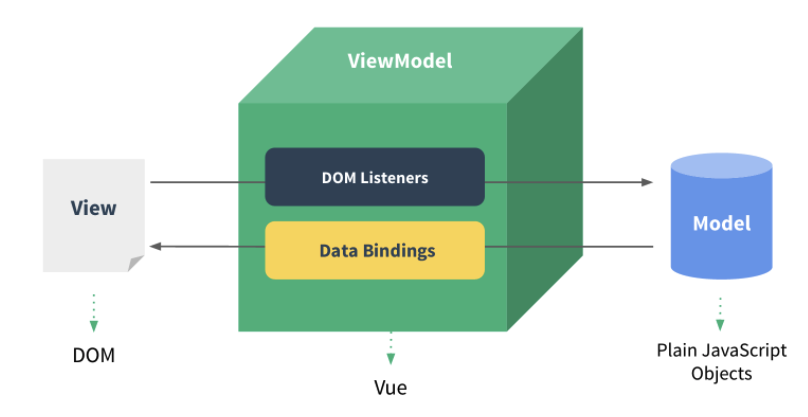

# Vue.js 프로젝트 투입 일주일 전

### Vue.js 특징

- MVVM 패턴 사용(Model-View-ViewModel)
    - View(HTML DOM)와 Model(JavaScript) 중간에 ViewModel을 둠으로써 데이터 바인딩 처리 및 가상 DOM을 통한 성능 및 개발의 편의성 제공

    

- 컴포넌트
    - View를 재사용할 수 있는 구조로 개발
    - Vue로 개발된 파일(.vue)하나하나가 모두 컴포넌트
    - import 해서 사용할 수 있다.


### Vue 프로젝트 생성하기

```bash
#Vue CLI 설치하기
npm install -g @vue/cli

#Vue 프로젝트 생성(default 옵션)
vue create vue-project

#Vue 프로젝트 매니저 실행
vue ui
```

### Vue Router 설정

- 라우팅: 사용자가 접속한 주소에 따라 페이지(컴포넌트)가 달라지는 것
- 페이지를 이동할때마다 서버에 요청해서 페이지를 새로 갱신하는 것이 아니라 클라이언트에서 미리 가지고 있던 페이지를 라우팅을 이용해서 화면 갱신

```bash
#@vue/cli-plugin-router가 설치됨
vue add router
```

- Lazy Load 적용하기(비동기 컴포넌트)
    - Lazy Load: 리소스를 컴포넌트 단위로 분리하여 컴포넌트 혹은 라우터 단위로 필요한 것들만 그때 그때 다운받을 수 있게 하는 방법
    - Lazy Load로 컴포넌트를 import 한 것은 내부적으로 Vue CLI의 prefetch 기능이 사용되는 것
        - prefetch: 미래에 사용될 수 있는 리소스를 캐시에 저장하여, 사용자가 접속했을 때 빠르게 리소스를 내려줌
        - prefetch 기능을 사용하면 request 요청 수가 증가한다. → 애플리케이션의 첫 화면 접속 시 랜더링 속도가 느려진다
        - prefetch 기능 삭제하기

        ```jsx
        import(/* webpackChunkName: "about" */ '../views/AboutView.vue');
        ```

        - 사용자가 접속할 가능성이 높은 컴포넌트는 한번에 다운로드 할 수 있게 설정, 사용자의 접속 빈도가 낮은 컴포넌트는 리소스를 내려받는 시점을 분리(prefetch 적용)


구독발행

computed:

watch: 실제 데이터가 변경이 되어야만 함수 실행

### 컴포넌트

View, Data, Code 세트

views에 화면 하나하나에 해당하는 vue 컴포넌트 파일 생성

components - 다른 vue 파일에서 호출해서 공통으로 사용할 수 있는 vue 컴포넌트 파일 생성, 관리

1. 컴포넌트 기본 구조
    1. 뷰 컴포넌트: name, components, data, computed, 라이프사잌클 훅
    2. Lifecycle Hooks
        1. 모든 컴포넌트는 생성될 때 초기화 단계를 거침.


### 양방향 데이터 바인딩

단방향은 이벤트를 통해서만 state 변화

양방향은 state 바로바로 업데이트

1. 문자열 데이터 바인딩

    ```html
    <h1>Hello, {{title}}</h1>
    ```

2. raw(원시) HTML 데이터 바인딩 : v-html 디렉티브 사용

    ```jsx
    <template>
      <div>
        <div>{{htmlString}}</div>
        <div v-html="htmlString"></div>
      </div>
    </template>
    
    <script>
    export default {
      data(){
        return{
          htmlString: '<p style="color:red;">This is a red String.</p>'
        };
      }
    }
    </script>
    ```

3. Form 입력 데이터 바인딩 : v-model 디렉티브 사용
    1. v-model은 내부적으로 서로 다른 속성을 사용하고, 서로 다른 입력 요소에 대해 서로 다른 이벤트를 전송한다.
4. input type=text
    1. v-model은 내부적으로 value 속성을 사용
    2. data()에 정의된 데이터 키명을 v-model에 넣어주면 data와 value 속성이 양방향으로 데이터 바인딩 설정됨
5. input type=number
    1. v-model.number 디렉티브 사용
    2. 사용자가 입력한 값은 문자가 아닌 숫자로 관리됨
6. textarea
    1. textarea 태그의 속성에 v-model 바인딩
7. select
    1. v-model은 내부적으로 select의 value 속성을 사용해서 양방향 데이터 바인딩함
8. checkbox
    1. v-model은 내부적으로 체크박스의 checked 속성을 사용
    2. value속성에 데이터 바인딩을 위해서는 v-model이 아닌 v-bind:value를 사용
    3. true-value, false-value를 지정하여 체크/해제 되었을때 기본값을 변경할 수 있다.
9. radio
    1. v-model은 내부적으로 checked 속성을 사용
    2. value속성에 데이터 바인딩을 위해서는 v-model이 아닌 v-bind:value를 사용
10. 속성(Attribute)
    1. value 제외한 html 객체의 속성에 데이터 바인딩을 할 때는 v-bind: 디렉티브 사용
    2. **v-bind 생략하고 :으로 사용 가능**
11. 리스트 랜더링
    1. v-for 디렉티브 이용
    2. `v-for=”(item, index) in items”`
12. 조건에 따라 랜더링
    1. v-if
        1. 조건을 만족하면 그 순간에 html 블록이 생성되고, 만족하지 않으면 삭제된다.
        2. 블록에 toggle이 일어날 때 v-show보다 더 많은 자원 사용: 해당 블록 전체를 생성했다가 삭제하기 때문
    2. v-show
        1. 조건 만족 여부와 관계없이 무조건 html 블록이 생성되고, 조건을 만족하면 css의 display를 이용해서 화면에 보이고, 만족하지 않으면 화면에서 숨긴다.
        2. 초기에 html 블록을 생성하는데에 자원을 사용

    → 자주 toggle이 일어나면 v-show 사용, toggle 빈도 적으면 v-if 사용하는것이 좋다.
13. 이벤트 처리
    1. v-on / @click
        1. 사용예시 : *`<button type="button" @click="increaseCounter">Add 1</button>`*
    2. v-change / @change
14. key 이벤트
    1. 키보드 입력되는지 감지하여 함수 호출
        1. 사용예시: `<input @keyup.enter=”submit”/>`
        2. `.enter` `.tab` `.delete` `.esc` `.space` `.up` `.down` `.left` `.right`
### computed와 watch

1. computed
    1. 데이터 값에 변경이 일어나는지 감시
    2. 기존에 정의된 데이터 값을 기반으로 새로운 데이터 값을 활용하기 위해 사용
2. watch
    1. 데이터 값에 변경이 일어나는지 감시
    2. watch에 정의된 데이터 값 하나만을 감시하기 위한 용도로 사용
    3. 실제 데이터 변경이 일어나기 전까지는 실행되지 않음
    4. 초기에 할당된 값이 반드시 변경이 일어나야만 watch가 실행

### 서버 데이터 바인딩

1. Axios
    1. 서버와 데이터를 송수신 할 수 있는 HTTP 비동기 통신 라이브러리. Promise 객체 형태로 값 return
    2. 설치 : `npm install axios —save`
2. Mixins
    1. 공통 함수 구현해서 각각의 컴포넌트에서 호출해서 사용하도록 함

### 컴포넌트 심화 학습

- [예제코드](https://github.com/RougeOnCheeks/vue-project-week-before/blob/main/src/components/PageTitle.vue)

### Provide/Inject

- [예제코드](https://github.com/RougeOnCheeks/vue-project-week-before/commit/7ec186bf97dbbeae9682bdc9f742fd41dd67c738)
- 어떤 부모 컴포넌트에서 전달되는지 확인이 안된다는 단점